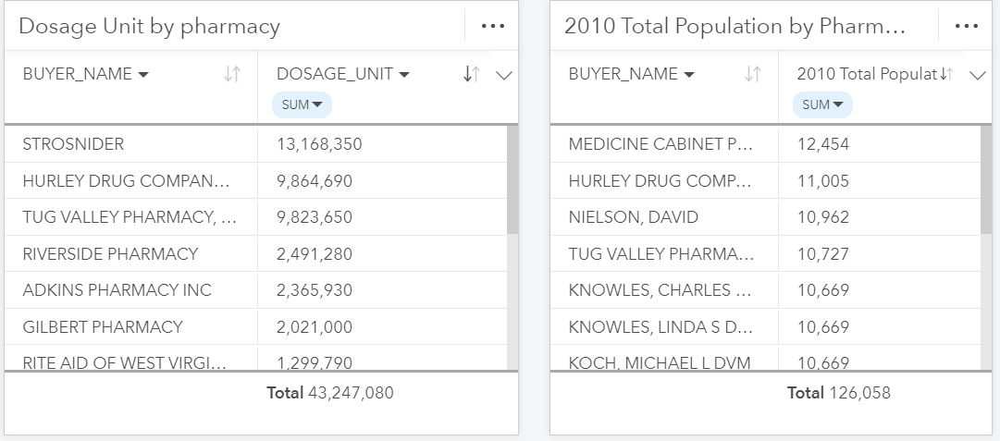

# Using ArcGIS Insights to investigate the DEA's pain pill database
I used desktop version of ArcGIS Insights to conduct the analysis on the DEA's pain pill database released by the Washington Post.  

## Method
1. Download the data
2. Open ArcGIS Insights on your desktop. 
3. Geocode the records for both our reporters and buyers fields.
4. Once you've repeated this step for both the buyers and the reporters, drag both the Address fields to your canvas to create a map.  
5. Drag the Address fields over Map to create a graduated point symbol of the pharmacies by count of prescriptions provided for Mingo County in West Virginia.
6. Click on Mingo County in the legend (upper right-hand corner of your map card), and click on the arrow to expand the Layer options window. 
7. Click on the checkbox next to Directional flow; then click on the Flip button to make sure that the arrow is pointed the correct way.  The flow should appear to go from the Reporter Address field to the Buyer Address. 
8. Next, change the weight of the link so that it reflects the sum of the DOSAGE_UNIT variable.   Click on a link or node to investigate it further.  
9. Clicl the action button and select enrich data.
10. Since we're working with the pharmacy locations, make sure you are searching for population data around the Pharmacy (Buyer) variable.  Enrich the data within 5 miles of the pharmacy locations. 
11. Next, click on the Open data browser button and get 2010 Total Population data
12. You can add other variables as you wish - just be aware that each variable you add will consume more credits. When done, click Apply at the bottom of your window, and change the distance value in step #4 to 5 miles. When ready, click Run.
13. And play around with the table.

## Personal take on ArcGIS Insights and ArcGIS Pro
[Pitch deck on ArcGIS Insights and ArcGIS Pro Comparison](https://docs.google.com/presentation/d/1JPHD2W4yHXo6l1XsdnEic5aHiKg4bGgfKdibC_-oUZw/edit?usp=sharing)

I personally enjoyed using ArcGIS Insights. I really loved how easy it was to generate analysis using the drag and drop interface. Though I believe if we want to provide some sophisticated analysis or make presentations (static), ArcGIS Pro would work better. I tried using ArcGIS Insights for one of my presentations last week. After I finished creating the maps, I found out the software doesn’t allow users to save individual cards. It took me a while to realize that I would have to either create an individual workbook or export the data and create a separate map on ArcGIS Pro to save it individually. In addition, ArcGIS Pro allows users have better customization including the maps itself and layouts, which made it easier to create PowerPoint slides.

Though, the effort it requires to create general maps is significantly less compared to ArcGIS Pro.  While I was working on the DEA pain pill data, it surprised me on how easy it was to do link analysis. You just had to select two location data and map it out. It definitely allowed similar work that you can do on Pro, while making the process easier for users.

I did have an issue enriching the data. As other have experienced, I ran into an issue where a separate table with enriched data did not appear, and instead the population got aggregated to the original table (table with buyer/provider excel data). So there were minor technical issues.

Though overall, it allows users to see the holistic view of the data. It is a great tool that allows wider audience to generate a general analysis or to start the analysis on.  
